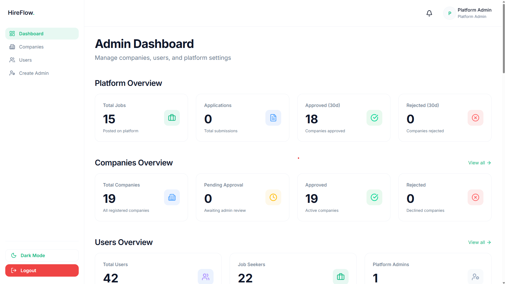
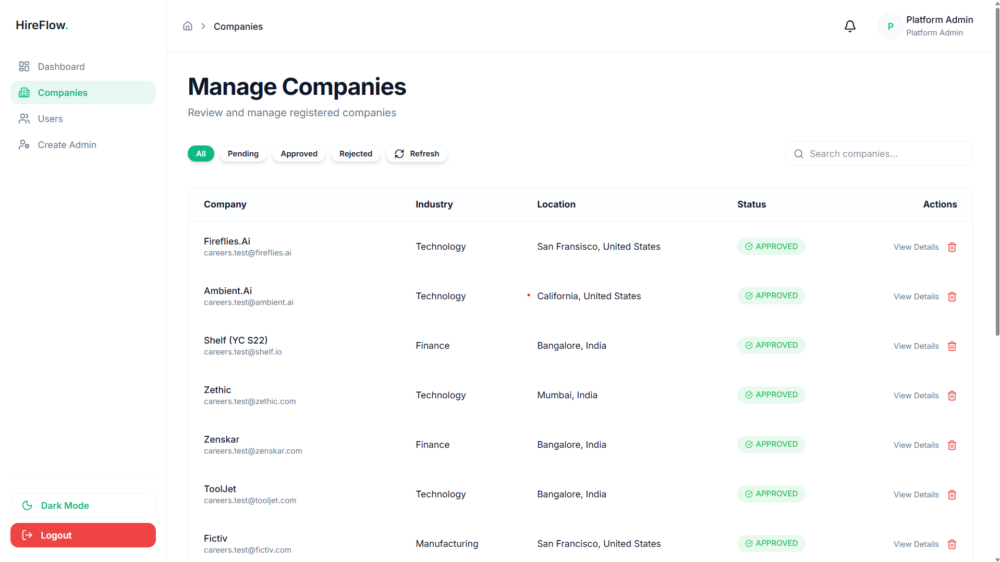
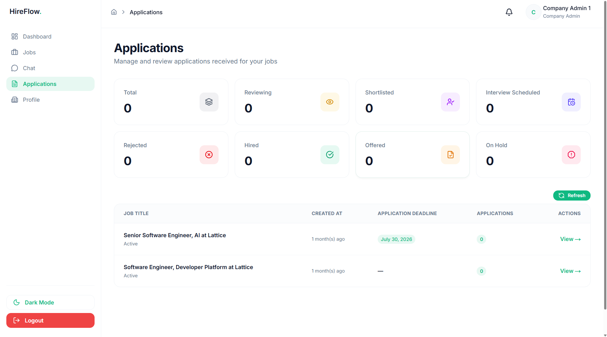
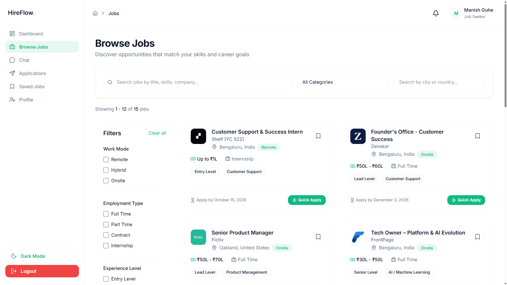
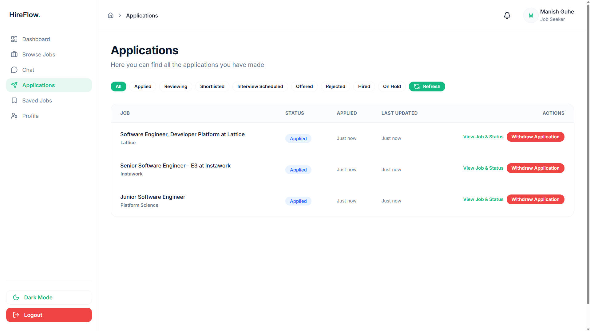
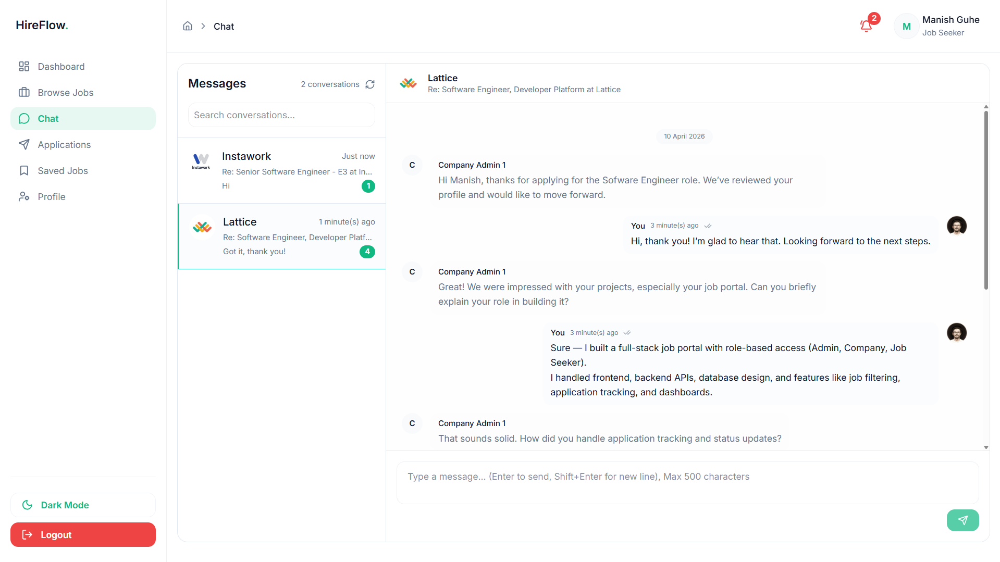

# HireFlow — Full-Stack Job Portal Platform

A production-grade job portal built with Next.js, featuring **multi-role architecture**, **real-world hiring workflows**, and **scalable system design**.

Supports three roles:

- **Platform Admin** — manages companies and platform analytics
- **Company Admin** — posts jobs and manages applications
- **Job Seeker** — searches jobs and tracks applications

---

## 🚀 Key Features

### 🧑‍💼 Platform Admin

- Company approval workflow (approve/reject with reasons)
- User & company management
- Platform analytics (users, jobs, applications)
- Activity monitoring dashboard

### 🏢 Company Admin

- Company profile with document verification
- Job posting & management (create, edit, close, duplicate)
- Application tracking with status workflow
- Resume viewing, notes, and bulk actions
- Company-level analytics dashboard

### 👤 Job Seeker

- Complete profile system (resume, skills, experience)
- Advanced job search with filters
- One-click job applications
- Application tracking with timeline
- Saved jobs & personalized dashboard

---

## 🧱 Core Capabilities

- **Role-Based Access Control (RBAC)** — strict separation of admin, company, and user flows
- **End-to-End Hiring Workflow** — job posting → application → hiring
- **Advanced Filtering & Search** — multi-criteria job discovery
- **File Handling** — resumes, company docs, images
- **Real-time UX** — debounced search, dynamic dashboards
- **Scalable Architecture** — serverless APIs + optimized DB queries

---

## 🛠️ Tech Stack

| Layer     | Technology                        |
| --------- | --------------------------------- |
| Framework | Next.js (App Router) + TypeScript |
| Styling   | Tailwind CSS                      |
| State     | Redux Toolkit                     |
| Forms     | React Hook Form + Zod             |
| Database  | MongoDB                           |
| ORM       | Prisma                            |
| Auth      | NextAuth.js                       |
| Storage   | Backblaze B2                      |
| Charts    | Recharts                          |

---

## 📸 Screenshots

### Platform Admin — Dashboard



### Platform Admin — Company Approval



### Company Admin — Job Management


### Company Admin — Applications



### Job Seeker — Job Search



### Job Seeker — Application Tracking



### Job Seeker & Company Admin – Chat



---

## ⚙️ Local Setup

```bash
git clone https://github.com/manishguhe301/hireflow-v2.git
cd hireflow-v2
npm install
npx prisma migrate dev
npm run dev
```

---

## 🧠 Key Learnings

- **RBAC complexity** — handled multi-role permissions across UI + API
- **Application workflow design** — built multi-stage hiring pipeline
- **Filtering performance** — optimized queries + debounced search
- **File handling** — secure uploads with validation
- **State management** — handled complex UI states using Redux

---

## 🎯 What This Demonstrates

- Full-stack system design
- Real-world SaaS architecture
- Complex data relationships
- Scalable UI + API patterns
- Production-level feature thinking

---

## 📧 Contact

- Email: [manishguhe301@gmail.com](mailto:manishguhe301@gmail.com)
- GitHub: https://github.com/manishguhe301/hireflow-v2
